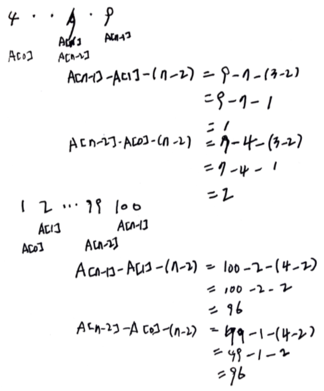
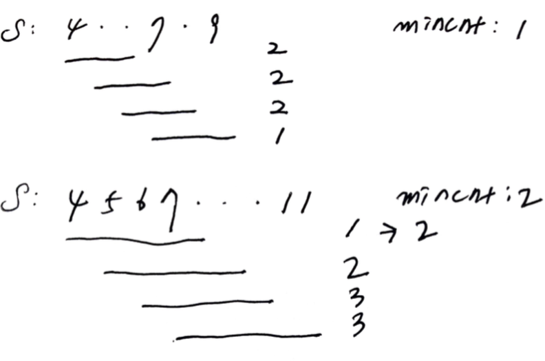

# Problem

[Moving Stones Until Consecutive II](https://leetcode.com/problems/moving-stones-until-consecutive-ii/)

# Idea

돌의 위치의 모음 `S[]` 가 주어진다. 처음과 끝에 놓인 돌의 위치를 end
point 라고 하자. end point 의 돌을 end point 아닌 위치로 옮겨서 모든
돌들의 위치가 연속이 되게 해보자. 가장 적게 움직인 회수 `mincnt` 와
가장 많게 움직인 회수 `maxcnt` 를 구하는 문제이다.

예를 들어 `S: 7 4 9` 의 경우를 살펴보자. 정렬하면 `S: 4 7 9` 와 같다.
`4` 를 `8` 로 바꾸면 `S: 7 8 9` 가 되고 `mincnt = 1` 이다. 한편 `9 ->
6, 7 -> 5` 를 하면 `S: 4 5 6` 이 되고 `maxcnt = 2` 이다.

위의 예를 이용해서 다음과 같은 규칙을 만들어 낼 수 있다.

* maxcnt

다시 `S: 4 7 9` 를 살펴보자. 중간에 숨겨진 숫자들을 슬롯이라
하자. 슬롯을 포함해서 표기하면 `S: 4 . . 7 . 9` 이다. 가장 왼쪽에 있는
`4` 를 옮겨서 오른쪽으로 이동했을 때 유효한 슬롯들의 개수와 가장
오른쪽에 있는 `9` 를 옮겨서 왼쪽으로 이동했을 때 유효한 슬롯들의
개수를 비교해서 더욱 큰 것이 `maxcnt` 이다. 유효한 슬롯들의 개수란 얼마든지 이동해서 유효한 슬롯들의 개수만큼 이동할 수 있다는 말이다.



* mincnt

`int n = S.size()` 이다. 다시 `S: 4 . . 7. 9` 를 살펴보자.  `n = 3`
이다. 크기가 `3` 인 슬라이드를 처음부터 이동하여 슬롯의 개수가 가장
적은 것이 `mincnt` 이다. 만약 슬라이드를 이동중 슬롯의 개수가 `1` 이면
end point 에서 end point 로 이동해야 하므로 이동이 불가능하다. `1`
대신 `2` 로 하자.



# Implementation

* [c++11](a.cpp)

# Complexity

```
O(NlgN) O(1)
```
