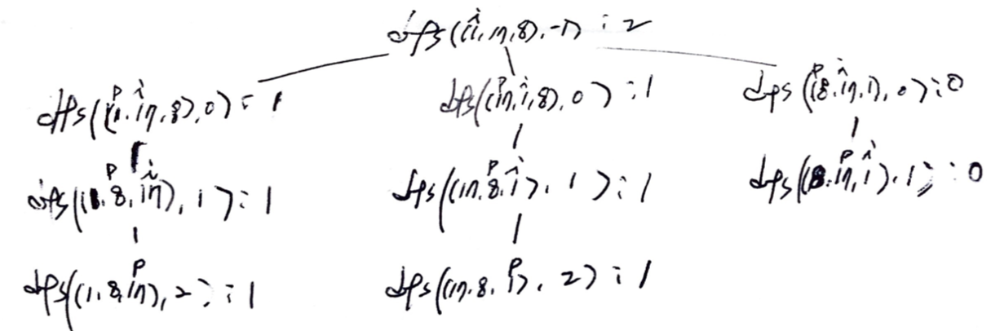

# Problem

[Number of Squareful Arrays](https://leetcode.com/problems/number-of-squareful-arrays/)

# Idea

수열 `A[]` 가 주어진다. `A[]` 순열들 중에 모든 숫자들에 대하여 서로 이웃한 숫자끼리 합하면 
완전제곱이 되는 순열의 개수를 구하는 문제이다.

순열은 dfs 를 이용한 backtracking 으로 어렵지 않게 탐색할 수 있다. 다음과 같이 부분문제를 정의하여 재귀적으로
풀어본다.

```cpp
int dfs(vector<int>& V, int s)

     V: 수열
     s: 시작 인덱스
return: 완전제곱 수열의 개수
```

다음은 앞서 언급한 부분문제 `dfs` 의 recursion tree 이다.



다음과 같은 사항을 주의하여 `dfs` 를 구현한다.

* `dfsAll` 을 사용하지 않기 때문에 `dfs(V, 0)` 대신 `dfs(V, -1)` 을 사용한다. 
* `dfs loop` 바깥에서 `unordered_set<int> ust` 선언하고 `ust.insert(V[i]).second == true` 이면 `dfs loop` 를 건너뛴다. 중복된 순열을 피할 수 있다. 인덱스 `i` 를 이용하여 `V[]` 를 순회하면서 `V[i]` 와 `V[s]` 를 swap 하는 것이기 때문에 `V[i]` 는 변하지만 `V[s]` 는 같은 값이다.
* `dfs loop` 에서 `s >= 0` 인 경우 `power((int)sqrt(A[i],A[s]),2) == A[i]+A[s]` 를 검사하여 인접한 두수가 완전제곱인지 검사한다.

# Implementation

* [c++11](a.cpp)

# Complexity

```
O(N!) O(N)
```