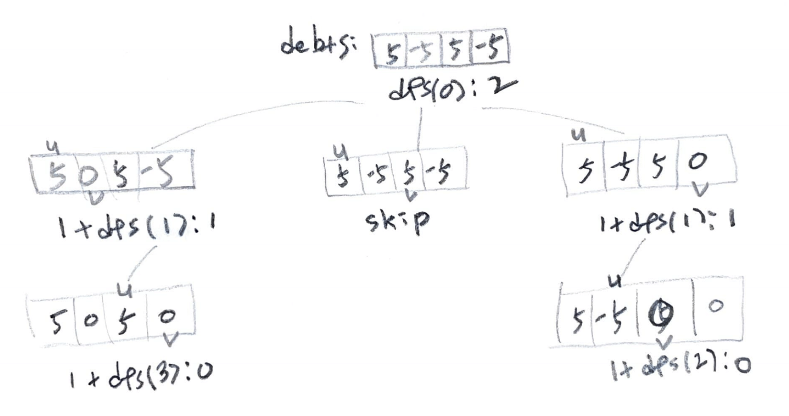

# Problem

[Optimal Account Balancing](https://leetcode.com/problems/optimal-account-balancing/)

`a` 가 `b` 에게 `c` 를 빌려주었다를 `(a, b, c)` 로 표현하고 이것을
트랜잭션이라고 하자. 트랜잭션의 모음 `T[]` 가 주어지면 모두 빛을
탕감하기 위해 필요한 최소 거래수를 구하는 문제이다.

# Idea

예를 들어 트랜잭션의 모음이 `T[] = ((0, 1, 10), (2, 0, 5)` 와 같다면
다음과 같이 그래프로 표현가능하다.

```
2 -> 0 -> 1
  5    10
```

`0` 은 `1` 에게 `10` 을 빌려주었으므로 `0` 의 빛은 `-10` 이고 `1` 의 빛은 `10`
이다.  `2` 는 `0` 에게 `5` 를 빌려주었으므로 `2` 의 빛은 `-5` 이고 `0` 의 빛은
`-5 = -10 + 5` 이다. 결과적으로 `0, 1, 2` 의 빛은 `-5, 10, -5` 이다. 

즉 `0` 은 누군가로 부터 `5` 를 얻고 `1` 은 누군가에게 `10` 을 주고 `2` 는
누군가로 부터 `5` 를 얻으면 정산이 완료된다. 예를 들어 `1` 이 `0, 2` 에게 `5` 씩
주면 거래의 횟수는 `2` 가 되고 이것이 곧 답이다.

빚의 모음 `debts[]` 가 있다면 [backtracking](/doc/backtracking.md) 으로 거래
횟수를 구할 수 있다. 거래의 횟수만 구하면 되기 때문에 유저의 아이디는 필요 없다.

다음과 같이 부분문제 `dfs` 를 정의하고 재귀적으로 해결한다.

```cpp
int dfs(vector<int> debts, int u)

return: 최소의 거래수
 debts: 빚의 모음
     u: 이번에 따져볼 debts 의 인덱스
```

예를 들어 `debts[] = (5, -5, 5, -5)` 라고 해보자. `sum(debts) == 0` 인 것을
기억하자. 빚을 적절히 옮겨서 `debts[]` 의 모든 원소가 0 이 됬을 때 최소로 이동한
횟수를 구하면 답이 된다.

`debts[u]` 에서 빚을 몽땅 빼서 `debts[v]` 에 더한다고 생각하자. 몽땅 뺏기 때문에
`debts[u]` 는 `0` 이 된다. 그러나 `debts[u] = 0` 을 굳이 수행하지는 않는다. 다시
방문할 일이 없기 때문이다. 

만약 이번에 방문할 `u` 에 대해 `debts[u] == 0` 이면 따져볼 필요가 없다. `u` 에서
`u + 1` 로 건너뛰자.

다음은 recursion tree 이다.



# Implementation

* [c++11](a.cpp)
* [java11](MainApp.java)

# Complexity

```
O(N!) O(N)
```
