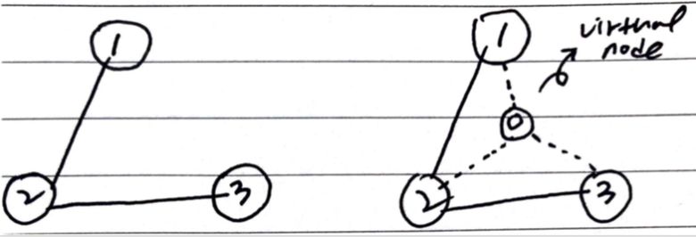

# Problem

[Optimize Water Distribution in a Village](https://leetcode.com/problems/optimize-water-distribution-in-a-village/)

# Idea

집의 개수 `n`, 우물의 정보 `W[]`, 파이프의 정보 `P[]` 가
주어진다. `W[i] = {u, v, cost}, P[i] = {u, v, cost}` 이다.  우물의
물은 파이프를 타고 집으로 전달된다. 모든 집에 최소 비용으로 물을
공급했을 때 그 비용을 구하는 문제이다.

전형적인 [MST (Minimal Spanning Tree)]() 문제이다. 어차피 모든 집은
파이프로 연결이 될 것이고 하나의 집에만 우물을 건설하면 된다. 다음과
같이 가상의 집 `0` 을 만들어서 모든 집에 우물의 비용으로 파이프를
연결해 놓자.  그리고 [kruskal](/fundamentals/graph/kruskal/README.md)
혹은 [prim](/fundamentals/graph/prim/README.md) 으로 해결한다.



# Implementation

* [c++11](a.cpp)

# Complexity

```
O(ElgE) O(V)
```
