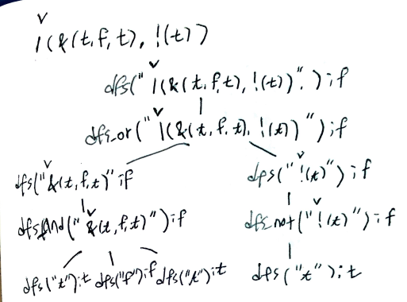

# Problem

[Parsing A Boolean Expression](https://leetcode.com/problems/parsing-a-boolean-expression/)

# Idea

문자열 `s` 가 주어진다. boolean expression 을 evaulation 한
결과를 구하는 문제이다.

다음과 같은 부분문제 `dfs, dfs_not, dfs_or, dfs_and` 를 정의하고 dfs 를 이용하여 해결한다. 

```c
dfs(string& s, int& i)
dfs_not(string& s, int& i)
dfs_and(string& s, int& i)
dfs_or(string& s, int& i)
```

recursion tree 는 다음과 같다.



# Implementation

* [c++11](a.cpp)

# Complexity

```
O(N) O(N)
```