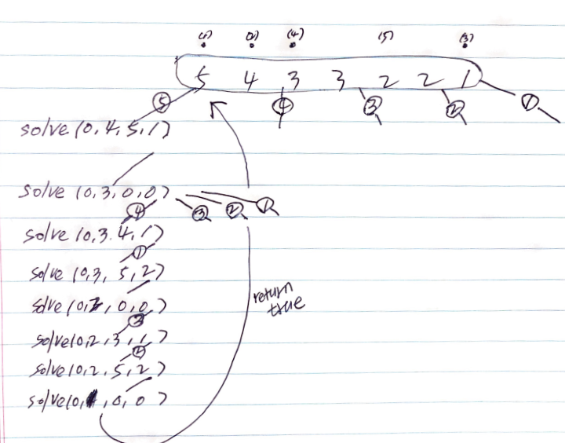

# Problem

* [Partition to K Equal Sum Subsets](https://leetcode.com/problems/partition-to-k-equal-sum-subsets/)

# Idea

`N` 개의 숫자가 주어지고 숫자 `K` 가 주어진다. 합이 같은 `K` 
개의 그룹을 만들 수 있는지 검증하는 문제이다.

다음과 같이 부분문제를 정의하고 dfs backtracking with pruning 으로
해결한다.

```
solve(int pos, int k, int sum, int ord)

pos: start index
  k: remained group count
sum: cumulative sum
ord: order to choose
```



# Implementation

* [c++11](a.cpp)

# Complexity

```
O(N!) O(N)
```