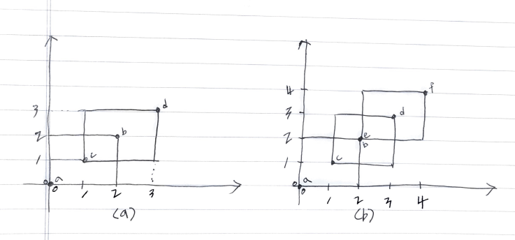

# Problem

* [Rectangle Area II](https://leetcode.com/problems/rectangle-area-ii/)

# Idea

line sweeping 을 이용한다.



위의 그림 a 와 같이 `(0,0) (2,2) (1,1) (3,3)` 이 주어졌다고 해보자.

맵 `smp_xydeg = {x, ({y, deg},...)}` 와 맵 `smp_yref = {y, refcnt}` 를 정의하자. 하나의 사각형을 구성하는 4 가지 점 `(LB, LT, RT, RB)` 을 `smp_xydeg` 에 저장한다. `LB, RT` 의 경우는 `deg` 가 `1` 이고 `LT, RB` 의 경우는 `deg` 가 `-1` 이다. `deg` 는 `dy` 를 구할 때 사용된다.

```
map<int, vector<pair<int, int>>> smp_xydeg;
map<int, int> smp_yref;
```

입력데이터를 이용하여 `smp_sydeg` 를 다음과 같이 채운다.

```
{0, ({0, 1}, {2, -1})}
{1, ({1, 1}, {3, -1})}
{2, ({0, -1}, {2, 1})}
{3, ({1, -1}, {3, 1})}
```

`smp_xydeg` 를 처음부터 순회한다. 현재 `x` 와 이전 `x` 의 차이인 `dx` 를 구한다. `dy` 는 바로 이전에 구한 높이이다. `dx * dy` 는 넓이를 의미하고 그것을 모두 더하면 답이다. 

 `smp_yref` 는 현재 `x` 까지 발생한 점들의 `y` 데이터로 채운다. `x` 가 `1` 일 때 발생한 점들은 `(0,0) (0,2), (1,1) (1,3)` 와 같다. 따라서 `smp_yref` 는 다음과 같다.

 ```
 {0, 1}
 {1, 1}
 {2, -1}
 {3, -1}
 ```

 `smp_yref` 를 순회하면서 `ref` 를 더한다. `ref` 가 `0` 이 될때 마다 겹치는 `y` 의 길이를 알 수 있다. 이것을 모두 더하여 `dy = 3` 에 저장한다.

다음은 `x, dx, dy` 를 정리한 것이다.

```
x dx dy
0  0  0
1  1  2
2  1  3
3  1  2
```

위의 그림 b 역시 마찬가지이다. 입력데이터 `(0,0) (2,2) (1,1) (3,3) (2,2) (4,4)` 이 주어졌다고 해보자.

입력데이터를 이용하여 `smp_sydeg` 를 다음과 같이 채운다.

```
{0, ({0, 1}, {2, -1})}
{1, ({1, 1}, {3, -1})}
{2, ({0, -1}, {2, 1}, {2, 1}, {4, -1})}
{3, ({1, -1}, {3, 1})}
{4, ({2, -1}, {4, 1})}
```

`x` 가 `2` 일 때 `smp_yref` 는 다음과 같다.

```
{0, 0}
{1, 1}
{2, 1}
{3, -1}
{4, -1}
```

`smp_yref` 를 순회하면서 `dy = 4` 를 구할 수 있다.

다음은 `x, dx, dy` 를 정리한 것이다.

```
  dx dy
0  0  0
1  1  2
2  1  3
3  1  3
4  1  2
```

# Implementation

* [c++11](a.cpp)

# Complexity

```
O(N^2) O(N)
```