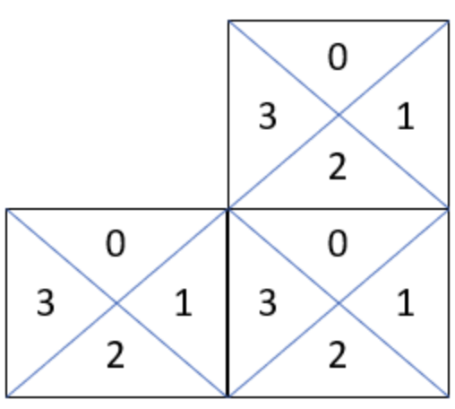

- [Problem](#problem)
- [DFS](#dfs)
  - [Idea](#idea)
  - [Implementation](#implementation)
  - [Complexity](#complexity)
- [Disjoint Set](#disjoint-set)
  - [Idea](#idea-1)
  - [Implementation](#implementation-1)
  - [Complexity](#complexity-1)

-----

# Problem

[Regions Cut By Slashes](https://leetcode.com/problems/regions-cut-by-slashes/)

그래프 `F[][]` 가 주어진다. `F[y][x]` 는 `/, \, 0` 중 하나 이다. 사선으로 만들어지는 격리된 공간의 개수를 세는 문제이다.

# DFS

## Idea

첫 번째로 떠오를 수 있는 해결 방법은 빈 공간을 기준으로 DFS(깊이 우선 탐색)를 수행하여 분리된 영역의 개수를 세는 방식입니다. 하지만 각 칸은 `/, \` 와 같은 정보를 포함하고 있어, 빈 칸과 사선이 겹쳐져 있습니다. 따라서 각 칸이 하나의 정보만 갖도록 변환할 필요가 있습니다.

해결책은 각 칸을 더 세분화하여 하나의 칸에서 하나의 정보만 가지도록 `3`배로 확대하는 것입니다. 이 방법을 통해 각 칸을 더 작은 영역으로 나누고, DFS를 통해 연결된 공간을 탐색하면, 각 독립된 컴포넌트의 개수가 곧 정답이 됩니다.

예시로 다음과 같은 그리드가 주어졌다고 가정합니다.

```
/\
\/
```

이것을 3배로 확장하면 각 셀이 하나의 정보만 갖도록 만들 수 있으며, 이를 통해 영역을 분리할 수 있습니다.

확장된 그리드는 아래와 같이 변환됩니다.

```
  /\
 /  \
/    \
\    /
 \  /
  \/
```

다음과 같은 방법으로 `F[][]` 배열을 `G[][]` 배열로 변환할 수 있습니다.


**변환 로직**
- `F[y][x] == '/'`인 경우에는 변환된 배열 G의 특정 위치에 값을 설정합니다.
- `F[y][x] == '\\'`인 경우에도 마찬가지로 변환된 배열 G의 적절한 위치에 값을 설정합니다.

```c
if (F[y][x] == '/')
  G[y*3][x*3+2] = G[y*3+1][x*3+1] = G[y*3+2][x*3] = 1;
if (F[y][x] == '\\')
  G[y*3][x*3] = G[y*3+1][x*3+1] = G[y*3+2][x*3+2] = 1;
```

이렇게 변환된 배열에서 DFS를 수행하여 연결된 영역을 찾고, 그 개수를 구하면 됩니다.

## Implementation

- [c++11](a.cpp)
- [java17](MainApp.java)

## Complexity

```
O(N^2) O(N^2)
```

# Disjoint Set

## Idea

이 문제에서 우리는 각 셀을 4개의 삼각형으로 나누어 관리하고, 이 삼각형들 간의 연결 관계를 추적하여 몇 개의 독립적인 영역(폴리곤)이 있는지 계산합니다. 이를 위해 Disjoint Set (Union-Find) 자료구조를 사용합니다.

**셀이 4개의 삼각형으로 나누어진다고 가정:** 주어진 n x n 그리드에서 각 셀을 4개의 삼각형으로 나눕니다. 각각의 삼각형을 Disjoint Set으로 관리하여, 삼각형들이 연결되면 하나의 큰 영역으로 합쳐집니다.



각 셀에는 4개의 삼각형이 존재합니다:

- 삼각형 0: 셀의 위쪽
- 삼각형 1: 셀의 오른쪽
- 삼각형 2: 셀의 아래쪽
- 삼각형 3: 셀의 왼쪽

**삼각형들 간의 연결을 처리:**

- union 함수를 통해 서로 연결된 삼각형들을 합칩니다. 같은 셀 내의 삼각형들끼리 또는 인접한 셀의 삼각형들끼리 연결됩니다.
- 셀이 `/`이면 삼각형 `0`과 `3`, `1`과 `2`가 연결되며, 셀이 `\`이면 삼각형 `0`과 `1`, `2`와 `3`이 연결됩니다.
- 인접한 셀끼리도 연결되며, 위쪽 셀의 아래 삼각형 `2`과 아래쪽 셀의 위 삼각형 `0`을 연결하고, 왼쪽 셀의 오른쪽 삼각형 `1`과 오른쪽 셀의 왼쪽 삼각형 `3`을 연결합니다.

**Disjoint Set의 역할:**

Disjoint Set을 통해 삼각형들이 서로 연결되어 있는지를 추적하며, 서로 다른 삼각형들이 합쳐질 때마다 영역의 개수를 줄여갑니다.

**흐름**

- 그리드를 순회하면서 각 셀의 삼각형들이 서로 연결되도록 union을 수행합니다.
- 각 연결이 발생할 때마다 독립된 영역이 하나로 합쳐지므로 영역의 개수를 줄여나갑니다.
- 최종적으로 남은 영역의 개수를 반환합니다.

## Implementation

- [java17](MainApp.java)

## Complexity

```
O(N^2) O(N^2)
```
