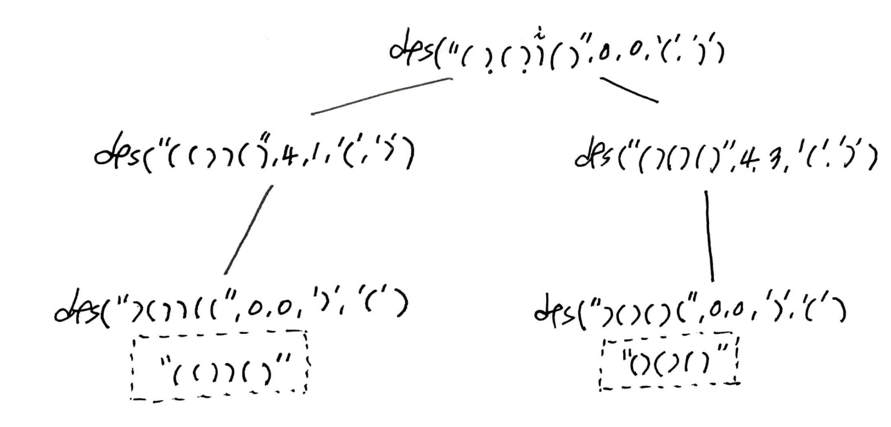

# Problem

> [Remove Invalid Parentheses](https://leetcode.com/problems/remove-invalid-parentheses/)

문자열 `s` 가 주어진다. `s` 는 `(, )` 및 alphabet 으로 구성되어
있다. 괄호의 짝이 맞도록 임의의 괄호를 제거해 보자.  모든 경우에
해당하는 문자열을 구하라.

# Idea

예를 들어 `s = "()())()"` 의 경우를 살펴보자.

```
s: ( ) ( ) ) ( )
   (   ( ) ) ( )
   ( ) ( )   ( )
```

따라서 답은 `["(())()", "()()()"]` 이다.

이문제를 해결할 핵심은 다음과 같은 2 가지이다.

* `s` 가 invalid 일때 괄호를 어떻게 제거할 것인가?
  * 인덱스 `i, j` 를 이용한다.
  * `i` 는 제거해야할 괄호의 종류를 나타내는 인덱스이다.
  * `j` 는 제거해야할 괄호의 인덱스이다.
* `s` 가 valid 인 것을 어떻게 판단할 것인가?
  * `int stck = 0` 을 선언하여 `(` 를 만나면 하나 증가하고 `)` 를 만나면 하나
    감소한다. `stck < 0` 이면 `s` 는 invalid 이다.
  * `s` 를 뒤집고 그것을 `r` 이라고 하자. `int stck = 0` 을 선언하여 `)` 를
    만나면 하나 증가하고 `(` 를 만나면 하나 감소한다. `stck < 0` 이면 `r` 는
    invalid 이다.
  * 하나의 algorithm 을 구상해서 `s` 를 foward, reverse 검증한다면 구현을
    simplify 할 수 있다.

앞서 언급한 핵심사항을 생각하며 다음과 같이 풀이 방법을 생각해 보자.    

`vector<string> ans` 를 선언하여 답을 저장한다.

인덱스 `i` 를 활용하여 `s` 를 처음부터 순회한다. `int stck = 0` 를 선언하여 `(`
를 만나면 하나 증가하고 `)` 를 만나면 하나 감소한다. `stck < 0` 이면 `)` 가 하나
많다는 의미이다. 인덱스 `j` 를 이용하여 `[lastJ..i]` 동안 순회한다. 이때 만나는
`)` 를 제거하고 다시 따져본다. 한편 `)` 가 여러개일 수도 있다. 그러나 답이
겹치는 걸 막기 위해 가장 먼저 만나는 `)` 를 제거한다.

이번에는 `s` 를 거꾸로 뒤집어서 앞서 언급한 알고리즘을 적용한다. `s` 를 뒤집은
문자열을 `r` 이라고 하자. 인덱스 `i` 를 활용하여 `r` 를 처음부터 순회한다. `int
stck = 0` 을 선언하여 `)` 를 만나면 `stck` 를 하나 증가하고 `(` 를 만나면 `stck`
를 하나 감소한다. `stck < 0` 이면 `(` 가 하나 많다는 의미이다. 인덱스 `j` 를
이용하여 `[lastJ..i]` 동안 순회한다. 이때 만나는 `(` 를 제거하고 다시 따져본다.
한편 `(` 가 여러개일 수도 있다. 그러나 답이 겹치는 걸 막기 위해 가장 먼저 만나는
`(` 를 제거한다. 

`s` 에 대해 forward, reverse 로 검증이 끝났다면 `ans` 에 추가한다.

다음과 같은 부분문제 `dfs` 를 선언한다.

```
int dfs(s, ans, lastI, lastJ, par0, par1)

return:
     s: input string
   ans: answer
 lastI: last i
 lastJ: last j
  par0: parenthese which increase stck
  par1: parenthese which decrease stck  
```

다음은 위에서 정의한 `dfs` 의 recursion tree 이다.



# Implementation

* [c++11](a.cpp)
* [java8](Solution.java)

# Complexity

```
O(2^N) O(N)
```
