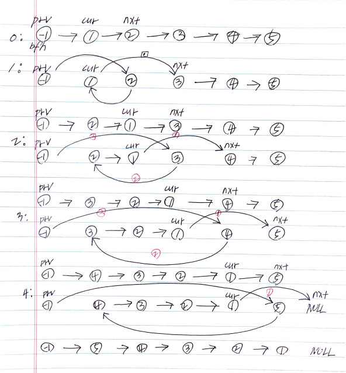

# Problem

* [Reverse Nodes in k-Group @ leetcode](https://leetcode.com/problems/reverse-nodes-in-k-group/)

# Idea

링크드리스트를 거꾸로 뒤집는 절차를 먼저 이해해야 한다.
`1->2->3->4->5` 와 같은 링크드 리스트가 있을 때 이것을 모두 뒤집어
보자. 우선 더미노드를 하나 만들어서 맨 앞에 삽입한다.



`prv, cur, nxt` 와 같이 세가지 변수를 이용해서 
다음과 같은 반복문을 통해 `k` 개수 만큼 링크드 리스트를 뒤집는다.

```cpp
while(i < k) {
  cur->next = nxt->next;
  nxt->next = prv->next;
  prv->next = nxt;
  nxt       = cur->next;
}
```

위의 그림을 살펴보면 `prv` 는 그대로 있고 `cur, nxt` 가
한칸씩 움직이는 것을 주목하자. 한번 뒤집을 때마다 첫번째 노드가 
바뀌기 때문에 `prv->next` 의 값이 바뀐다. 따라서 `prv` 
항상 같은 노드를 가리킨다.

`cur` 역시 한번 뒤집을 때마다 한칸씩 이동하는 것처럼 보이지만
항상 같은 노드를 가리킨다.

`k` 개수 만큼 링크드 리스트를 뒤집고 나서 다음과 같이 `prv, cur, nxt`
를 초기화 하고 다시 위의 반복문을 수행한다.

```cpp
    while (cnt >= k) {
      cur = prv->next;
      nxt = cur->next;
      for (int i = 1; i < k; ++i) {
        cur->next = nxt->next;
        nxt->next = prv->next;
        prv->next = nxt;
        nxt       = cur->next;
      }
      prv = cur;
      cnt -= k;
    }
```

# Implementation

* [c++11](a.cpp)

# Complexity

```
O(N) O(1)
```
