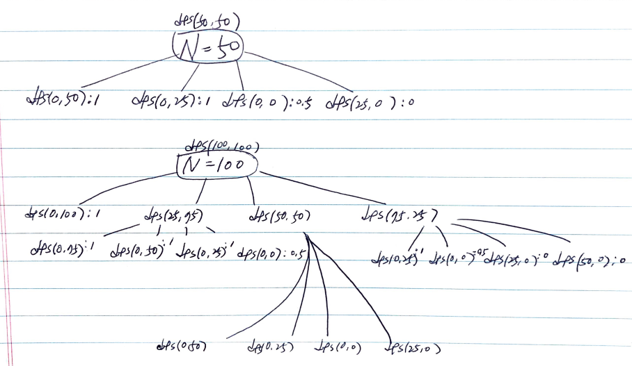

# Problem

[Soup Servings](https://leetcode.com/problems/soup-servings/)

# Idea

숫자 `N` 이 주어진다. A 과 B 컵에 각각 `N` ml 만큼 수프가 있다.
다음과 같이 4 가지 동작중 하나를 할 수 있다. 모든 동작은 동일한
확률 0.25 를 갖는다.

* Serve 100 ml of soup A and 0 ml of soup B
* Serve 75 ml of soup A and 25 ml of soup B
* Serve 50 ml of soup A and 50 ml of soup B
* Serve 25 ml of soup A and 75 ml of soup B

`A` 가 비워질 확률과 `A, B` 가 모두 비워질 확률의 반을 구하는 문제이다.

부분문제 `double dfs(int A, int B)` 를 다음과 같이 정의하여 재귀적으로 구현해 보자.

```c
double dfs(int A, int B)

     A: A 컵의 남은 용량
     B: B 컵의 남은 용량
return: A 가 비워질 확률과 A, B 가 모두 비워질 확률의 절반
```

* `A == 0 && B != 0` 이면 1 을 리턴한다.
* `A == 0 && B == 0` 이면 0.5 를 리턴한다.
* `A != 0 && B == 0` 이면 0 을 리턴한다.
* 그외의 경우는 `0.25 * (dfs(A-100, B) + dfs(A-75, B-25) + dfs(A-50, B-50) + dfs(A-25, B-75))` 를 리턴한다.

예를 들어 `N = 50` 일 때 다음과 같이 recursion tree 를 구성할 수 있다.



캐시 `vector<vector<int>> C` 를 선언하여 memoization 할 수 있다.

문제의 조건에 의해 10^-6 까지 정확도를 유지하면 된다.

* N = 4800, the result = 0.999994994426
* N = 4801, the result = 0.999995382315

따라서 `N >= 4800` 이면 1 을 리턴하자.

# Implementation

* [c++11](a.cpp)

# Complexity

```
O(N^2) O(N)
```