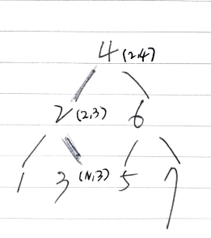

# Problem

루트트리노드 `u` 와 숫자 `n` 이 주어진다. `n` 보다 작거나 같은 값을 갖는
노드와 큰 값을 갖는 노드로 분리하는 문제이다.

* [Split BST](https://leetcode.com/problems/split-bst/submissions/)

# Idea

모든 노드를 방문할 필요는 없다.



노드 `4` 를 방문한다. `(2,4)` 를 리턴해야 한다.
노드 `2` 를 방문한다. `(2,3)` 를 리턴해야 한다.
노드 `3` 을 방문한다. `(N,3)` 를 리턴해야 한다.

# Implementation

* [c++11](a.cpp)

# Complextiy

```
O(N) O(1)
```

