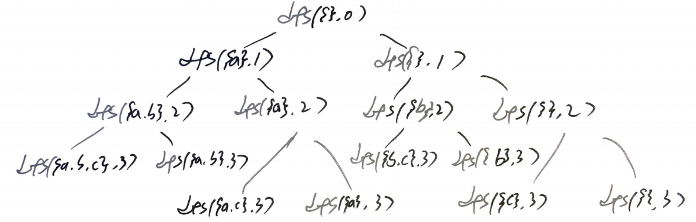

# Problem

[Subsets](https://leetcode.com/problems/subsets/)

수열 `nums[]` 가 주어진다. 부분집합을 모두 구하라.

# Bit Manipulation

## Idea

예를 들어 `nums = [1, 2, 3]` 인 경우를 살펴보자.

부분집합 즉 power set 의 개수는 `2^n - 1` 이다.

`int n = 1 << nums.length` 를 선언하여 power set 의
후보들을 저장한다.

인덱스 `i` 를 `[0..n)` 동안 순회하면서 다음을 반복한다.
* `List<Integer> subset = new ArrayList<>()` 를 선언하여 부분집합을
  저장한다.
* 인덱스 `j` 를 `[0..nums.length)` 동안 순회하면서 다음을 반복한다.
  * `i` 의 bit field 중에 `j` 가 존재하면 `subset` 에 `nums[j]` 를
    추가한다. 즉, `(i & (1 << j)) > 0` 이면 `subset.add(nums[j])` 를
    수행한다.
* `ans` 에 `subset` 를 삽입한다.
    
모든 반복을 마치면 `ans` 가 곧 답이다.

## Implementation

* [c++11](a.cpp)
* [java8](Solution.java)

# Backtracking

## Idea

다음과 같은 부분 문제 `dfs` 를 구현한다.

```
void dfs(List<List<Integer>> ans, 
         List<Integer> subset, 
         int[] nums,
         int i)
   ans: answer
subset: current subset
  nums: input
     i: index to visit
```

다음과 같은 recursion tree 를 구현할 수 있다.




## Implementation

* [c++11](a.cpp)
* [java8](Solution.java)

# Complexity

```
O(2^N) O(2^N)
```
