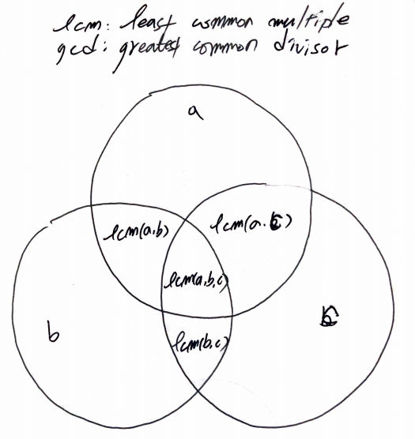

# Problem

[Ugly Number III](https://leetcode.com/problems/ugly-number-iii/)

# Idea

숫자 `n, a, b, c` 가 주어진다. `a` 혹은 `b` 혹은 `c` 로 나누어
떨어지는 수를 Ugly number 라고 한다. `n` 번째 Ugly number 를 구하는
문제이다.



어떤 수 `N` 이 주어지면 `a` 의 배수의 개수는 다음과 같이 구한다.

```
count of multiple of a: N / a
```

또한 어떤 수 `N` 이 주어지면 `a, b` 의 공통 배수의 개수는 `lcm(a, b)` 의 배수 개수와 같다.

```
count of multiple of lcm(a, b): N / lcm(a, b)
                     lcm(a, b): a * b / gcd(a, b)
```

마찬가지로 어떤 수 `N` 이 주어지면 `a, b, c` 의 공통 배수 개수는 `lcm(a, b, c)` 의 배수 개수와 같다.

```
count of multiple of lcm(a, b, c): N / lcm(a, b, c)
                     lcm(a, b, c): a * b * c / gcd(a, b, c)
```

따라서 수 `N` 이 주어지면 숫자 `a, b, c` 의 Ugly Number 개수는 다음과 같이 구한다.

```
count of Ugly number of a, b, c: 
  N/a + N/b + N/c -
  N/lcm(a,b) - N/lcm(b,c) - N/lcm(a,c) +
  N/lcm(a,b,c)
```

`n` 번째 Ugly number 를 `[0..inf]` 에서 binary search 한다.

# Implementation

* [go](a.go)

# Complexity

```
O(lgN) O(1)
```
