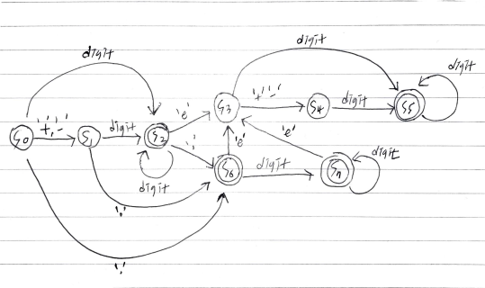

# Problem

* [Valid Number @ leetcode](https://leetcode.com/problems/valid-number/)

문자열 `s` 가 주어진다. 숫자인지 검증하는 문제이다.

# Idea

다음과 같은 문자열들은 참이다.

```
"2"
"0089"
"-0.1"
"+3.14"
"4."
"-.9"
"2e10"
"-90E3"
"3e+7"
"+6e-1"
"53.5e93"
"-123.456e789"
```

그러나 다음과 같은 문자열들은 거짓이다.

```
"abc"
"1a"
"1e"
"e3"
"99e2.5"
"--6"
"-+3"
"95a54e53"
```

Deterministic Finite Automaton 으로 접근했지만 너무 어렵다.



더욱 수월한 방법으로 접근해 보자. 먼저 `s` 를 trim 한다. 그리고 다음과
같은 boolean flags 들을 생각해 보자.

```
boolean dotSeen = false;     // . 을 지나갔는가?
boolean eSeen = false;       // e 를 지나갔는가?
boolean numberSeen = false;  // 숫자를 지나갔는가?
boolean eNumberSeen = false; // e 다음 숫자를 지나갔는가?
```

`s` 를 처음부터 순회하면서 현재 방문한 문자가 무엇인지에 따라
앞서 선언한 flags 를 점검한다. 그것의 일부를 표현하면 다음과 같다.

```java
for (int i = 0; i < s.length(); i++) {
  char c = s.charAt(i);
  if (c is 숫자) {
  } else if (c is '.') {
  } else if (c is 'e' 혹은 `E` 일때) {
  } else if (c is '-' 혹은 `+` 일때) {
  } else {
    return false;
  }
}
```

모든 반복을 마치고 `numberSeen && eNumberSeen` 이면 true 를 리턴한다.

# Implementation

* [c++11](a.cpp)
* [java8](MainApp.java)

# Complexity

```
O(N) O(1)
```
