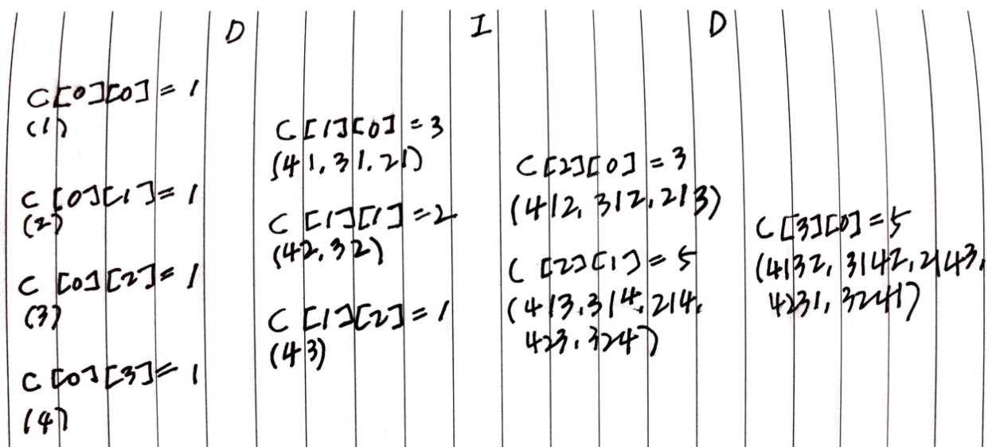

# Problem

[Valid Permutations for DI Sequence](https://leetcode.com/problems/valid-permutations-for-di-sequence/)

# References

* [2d loop descending decreasing](/fundamentals/matrix/loopdescdec/README.md)

# Idea

`D, I` 로 구성된 문자열 `s` 가 주어진다. 다음을 규칙을 따르는
`[1..s.size()]` 범위 숫자의 순열 개수를 구하는 문제이다.

* If `S[i] == 'D'`, then `P[i] > P[i+1]`, and;
* If `S[i] == 'I'`, then `P[i] < P[i+1]`.

예를 들어 `DID` 의 경우를 살펴보자. 다음과 같이 여러 순열을 생각해 볼
수 있다. 답은 `5` 이다.

```
D I D    D I D    D I D    D I D
1          
2        2 1      2 1 3    
                  2 1 4    2 1 4 3
3        3 1      3 1 2
                  3 1 4    3 1 4 2
         3 2      3 2 4    3 2 4 1
4        4 1      4 1 2    
                  4 1 3    4 1 3 2
         4 2      4 2 3    4 2 3 1
         4 3       
```

캐시 `C[i][j]` 를 선언하자. `C[i][j]` 는 `i` 개수의 숫자를 사용하고
`i + 1` 번째 숫자는 이미 사용된 숫자를 제외하고 `j + 1` 번째 작은
숫자인 순열의 개수를 의미한다. 예를 들어, `C[0][3]` 은 `0` 개의 숫자를
이미 사용했고 `1` 번째 숫자는 `4` 번째로 작은 숫자인 순열 `4` 의
개수를 의미한다. 즉, `C[0][3] = 1` 이다.



위의 그림을 참고하여 다음과 같은 규칙을 생각해 볼 수 있다.

* `C[0][j] = 1` 이다. 
  * `0` 개의 숫자를 사용하고 `1` 번째 숫자를 `j + 1` 번째 작은 숫자를 사용한 순열의 개수는 당연히 `1` 이다.
* `s[i] == D` 이면 `C[i+1][j] = C[i][j+1] + C[i][j+2] + ... + C[i][n-1]`
  * `C[1][0] = C[0][3] + C[0][2] + C[0][1]` 이다. 
  * `O(N)` 으로 수행하기 위해 다음과 같이 구현한다.

```c
        for (int j = n-i-1, k = 0; j >= 0; --j)
          k = C[i+1][j] = (k + C[i][j+1]) % mod;
```

* `s[i] == I` 이면 `C[i+1][j] = C[i][0] + C[i][1] + ... + C[i][j]` 
  * `C[2][1] = C[1][0] + C[1][1]` 이다. 
  * `O(N)` 으로 수행하기 위해 다음과 같이 구현한다.

```c
        for (int j = 0, k = 0; j < n - i; ++j)
          k = C[i+1][j] = (k + C[i][j]) % mod;
```

`C[i][j]` 를 모두 채우면 `sum(C[n][i])` 가 곧 답이다.

# Implementation

* [c++11](a.cpp)
* [java8](Solution.java)
* [python3](a.py)
* [go](a.go)

# Complexity

```
O(N^2) O(N^2)
```
