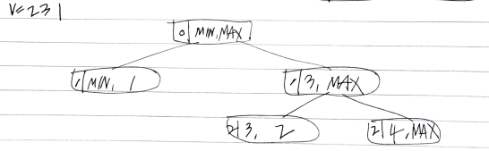

# Problem

* [Verify Preorder Sequence in Binary Search Tree](https://leetcode.com/problems/verify-preorder-sequence-in-binary-search-tree/)

# Recursive Way

## Idea

다음과 같이 단순한 형태의 BST 와 preorder 에 대해 생각해 보자.

```
NULL          2          2          2
                        /          / \
                       1          1   3
()           (2)       (2 1)      (2 1 3)
```

다음과 같이 부분문제를 정의하자. 

```cpp
solve(V[], int lo, int hi)

lo: V[m_i] 의 허용 가능한 최소값
hi: V[m_i] 의 허용 가능한 최대값
```

`preorder` 의 첫번째는 루트노드를 의미한다.
나머지는 왼쪽 자손들 오른쪽 자손들로 나눌 수 있다.
왼쪽 자손들의 값은 루트의 값보다 작아야 한다.
오른쪽 자손들의 값은 루트의 값보다 커야 한다.

`int m_i` 를 선언하고 `V` 를 재귀적으로 
순회한다. 순회를 마치고 `m_i == V.size()` 이면
위 규칙을 모두 지켰다는 의미이기 때문에 `true` 가 답이다.

다음과 같이 `V = 2 1 3` 에 대한 recursive tree 를 그려보자.


다음은 `V = 2 3 1` 에 대한 recursive tree 이다.



## Implementation

* [c++11](a.cpp)

## Complexity

```
O(2^N) O(N)
```

# Iterative Way

## Idea

updating...

## Implementation

* [c++11](a.cpp)

## Complexity

```
O(N) O(1)
```