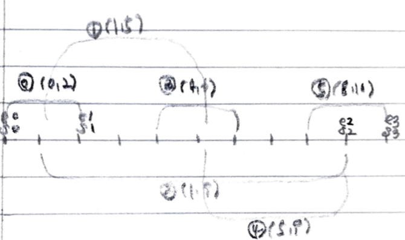

# Problem

[Video Stitching](https://leetcode.com/problems/video-stitching/)

비디오 클립의 시작과 끝시간의 모임 `C[]` 와 시간 `T` 가 주어진다.
최소 개수의 클립을 사용하여 시간 `[0, T]` 를 재생할 수 있는 새로운
클립을 만들어 보자. 이때 클립의 최소 개수를 구하는 문제이다.

# Idea

전형적인 greedy 문제이다. 반복할 때마다 가장 긴 시간을 재생하도록
클립들을 선택해 보자.

예를 들어 `C = {{0, 2}, {4, 6}, {8, 10}, {1, 9}, {1, 5}, {5, 9}}, T =
10` 인 경우를 살펴보자.



 먼저 `C[]` 를 오름차순으로 정리한다. `int s = 0, e = 0` 를 선언하여
가장 긴시간의 클립을 선택했을 때 그 시작 시간과 종료 시간을
저장한다. `s, e` 두개의 변수를 활용하기 때문에 two pointers 라고 할만 하다.

또한 `int i` 를 이용하여 후보 클립을 순회한다.  그리고 `s < T` 인 동안 다음을 반복한다.

* `C[i] <= s` 를 만족하는 후보 클립들 중 종료 시간이 가장 긴 클립을 선택하고
  그 종료 시간을 `e` 에 저장한다.
* 만약 선택할 클립이 없다면 `s == e` 가 된다. 이때는 `-1` 을 리턴한다.
* 클립을 하나 선택했다면 `ans++` 하자.
* `s = e` 를 수행한다.

모든 반복이 끝나면 `ans` 가 곧 답이다. 

# Implementation

* [c++11](a.cpp)
* [java8](Solution.java)

# Complexity

```
O(NlgN) O(1)
```
