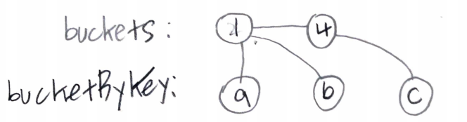
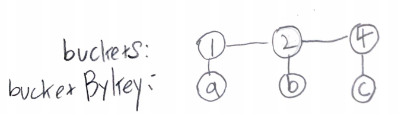
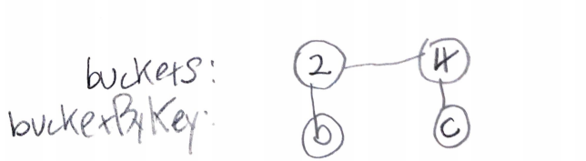

# Problem

[All O`one Data Structure](https://leetcode.com/problems/all-oone-data-structure/)

# Idea

`inc(Key), dec(Key), getMaxKey(), getMinKey()` 가 `O(1)`
에 이루어지도록 구현하는 문제이다.

[LRU](/leetcode/LRUCache/README.md) 와 비슷하게 bidirectional indexing 
전략을 활용한다.

먼저 다음과 같은 자료구조를 선언한다.

```cpp
struct Bucket {
  int value;
  unordered_set<string> keys;
}
list<Bucket> buckets;
unordered_map<string, list<Bucket>::iterator> bucketByKey;
```

`buckets` 는 오름차순이 되도록 유지한다. 



* `getMinKey()`

`buckets.begin()` 와 같다. 

* `getMaxKey()`

`buckets.rbegin()` 와 같다. 

* `inc(k)`

`bucketByKey[k]` 가 없다면 새로운 node 를 삽입해야 한다. 새로운 node
는 항상 `buckets` 의 처음에 삽입한다.

`k` 를 갖는 node 를 `u` 라고 하자. `u` 의 다음 node 를 `n` 라고
하자. `n == NULL` 이거나 `u.value + 1 < u.value` 이면 새로운 node `v`
를 `u` 와 `n` 사이에 삽입한다. 이제 `u.keys` 에서 `v.keys` 로 `k` 를
이동한다.

이때 `u.keys` 가 비어있다면 `u` 를 제거한다.



* `dec(k)`

`k` 를 갖는 node 를 `u` 라고 하자. `u` 의 이전 node 를 `p` 라고 
하자. `u == buckets.begin()` 이거나 `p.value < u.value - 1` 이면
새로운 node `t` 를 `p` 와 `u` 사이에 삽입한다. 이제 `u.keys` 에서
`t.keys` 로 `k` 를 이동한다.

이때 `u.keys` 가 비어있다면 `u` 를 제거한다.



# Implementation

* [c++11](a.cpp)
* [java17](MainApp.java)

# Complexity

```
      inc: O(1)
      dec: O(1)
getMinKey: O(1)
getMaxKey: O(1)
```
