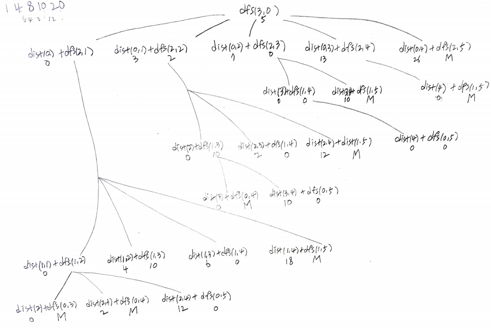

# Problem

* [Allocate Mailboxes](https://leetcode.com/problems/allocate-mailboxes/)

집들의 위치 `H[i]`, 우편함의 개수 `k` 가 주어진다. 각 집에서 가까운
우편함까지 거리의 합이 최소가 되도록 우편함을 적당히 배치한다. 이때
거리의 합을 구하라.

# Idea

우편함은 집들의 위치에 놓아도 거리의 합이 최소가 될 수 있다.
`k` 개의 우편함을 `H[]` 에 배치하는 것과 같다.
[Palindrome Partitioning III](https://github.com/iamslash/learntocode/blob/master/leetcode2/PalindromePartitioningIII/README.md) 와 유사하다.

다음과 같은 부분문제 `dfs` 를 선언하고 재귀적으로 해결한다.

```
int dfs(vector<vector<int>>& C, vector<int>& H, int k, int u)

return: minimum distance
     C: cache
     H: position of houses
     k: the number of mailboxes remained
     u: start index of mailbox
```

다음은 `H = [1, 4, 8, 10, 20], k = 3` 인 경우 recursion tree 이다.



# Implementation

* [c++11](a.cpp)

# Complexity

```
```
