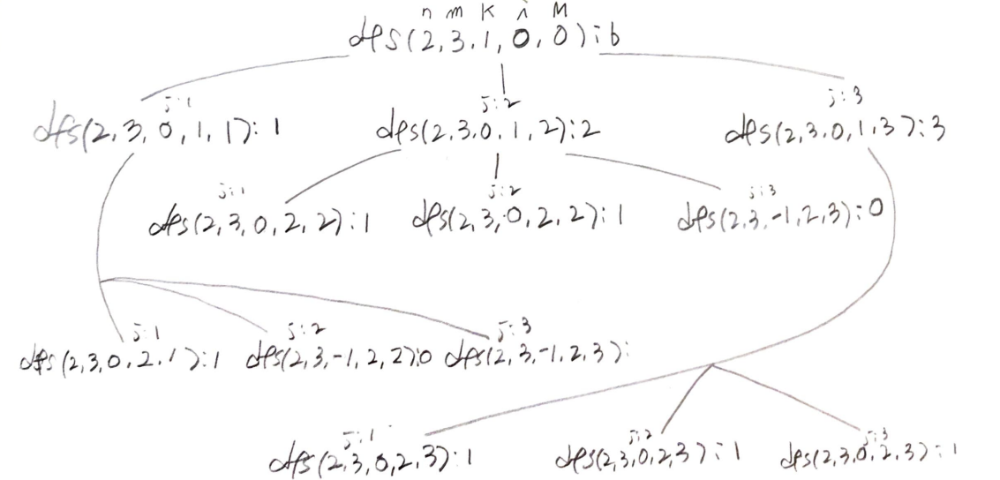

# Problem

[Build Array Where You Can Find The Maximum Exactly K Comparisons](https://leetcode.com/problems/build-array-where-you-can-find-the-maximum-exactly-k-comparisons/)

# Idea

숫자의 개수 `N`, 최고값 `M`, searchCost 의 수 `K` 가 주어진다. 다음
알고리즘을 만족하는 `N` 개 숫자들의 경우의 수를 구하는 문제이다.

```
maxVal = -1
maxIdx = -1
searchCost = 0
n = A.length
for (i = 0; i < n; ++i) {
    if (maxVal < A[i]) {
        maxVal = A[i]
        maxIdx = i
        searchCost += 1
    }
}
return maxIdx;
```

다음과 같이 부분문제 `dfs(n, m, k, i, maxVal)` 를
선언하고 recursion tree 를 그려보자.`

```
int dfs(n, m, k, i, maxVal)
     n: 수열의 개수
     m: 수열중 가장 큰값
     k: 검색비용
maxVal: 현재 최고값
```



dynamic programming 으로 해결할 만하다.
overlapping subproblem 을 해결하기 위해 다음과 같이
`int C[m][n][k]` 를 선언한다.

```
int C[maxVal][i][k]

maxVal: 최고값
i: 제작할 숫자의 인덱스
k: 검색비용
```

# Implementation

* [c++11](a.cpp)

# Complexity

```
O(K^M) O(NMK)
```
