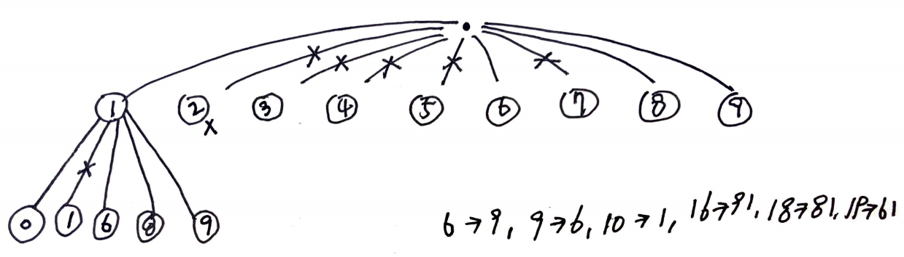

# Problem

[Confusing Number II](https://leetcode.com/problems/confusing-number-ii/)

숫자 `N` 이 주어진다. 1 부터 N 까지 숫자 중 180 도 회전했을 때 원래
숫자와 다른 숫자가 되는 경우의 수를 구하는 문제이다. `0, 1, 6, 8, 9`
는 180 도 회전하면 `0, 1, 9, 8, 6` 이 된다. `2, 3, 4, 5, 7` 은
회전했을 때 옳바른 숫자가 되지 않는다.

# Idea

예를 들어 `N = 20` 인 경우 다음과 같이 recursion tree 를 그려 볼 수
있다.



# Implementation

* [go](a.go)

# Complexity

```
O(N) O(lg_10_N)
```
