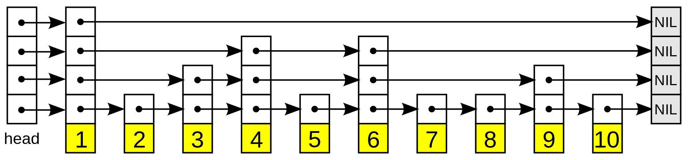

# Problem

[Design Skiplist](https://leetcode.com/problems/design-skiplist/)

# References

* [Skip list @ wikipedia](https://en.wikipedia.org/wiki/Skip_list)
* [Skip list @ youtube](https://www.youtube.com/watch?v=7pWkspmYUVo&feature=emb_logo)

# Idea

Design Skip List.

Skip List is a list with additional lists like this.



Additional lists are consisted of promotioned node randomly.

# Implementation

* [c++11](a.cpp)

# Complexity

```
search: O(N) O(1)
   add: O(N) O(1)
 erase: O(1) O(1)
```
