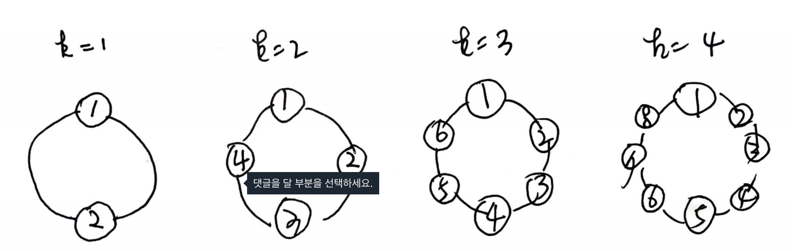
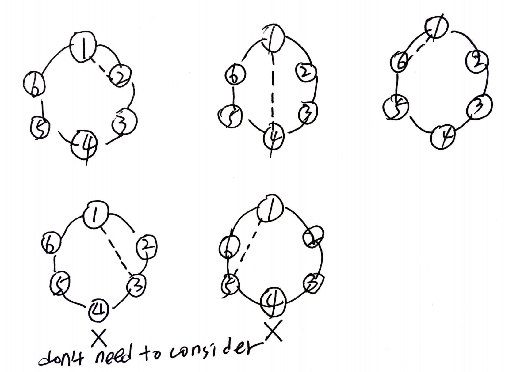

# Problem

[Handshakes That Don't Cross](https://leetcode.com/problems/handshakes-that-dont-cross/)

사람의 수 `n` 이 주어진다. `n` 은 항상 짝수이다. `n` 명의 사람들은
원을 그리며 서있다. 각 사람은 다른 한 사람을 골라 악수를 한다. 나머지 사람들은
이미 악수하고 있는 사람들을 가로질러 악수할 수는 없다. 모든 사람들이
악수를 하는 방법의 가지수를 구하라.

# Idea

두 사람씩 짝지었을 때 그룹의 개수를 `k` 라고 하자. 다음은 `k` 에 따라
사람들의 배치이다.



한 사람이 다른 사람과 악수를 하면 왼쪽 그룹과 오른쪽 그룹이 만들어
진다.  그 왼쪽 그룹의 가짓수와 오른쪽 그룹의 가짓수를 곱하면 총
가짓수가 된다. 



예를 들어 3 개짜리 그룹의 경우 (k=3) 를 생각해 보자.  어떤 사람이 짝을
이루었을 때 총 가지수는 다음과 같다.  위 그림과 같이 x 표시의 경우는
정상적으로 짝지워질 수 없기에 생각할 필요가 없다.

```
왼쪽 그룹 0 개의 가짓수 * 오른쪽 그룹 2 개의 가짓수 +
왼쪽 그룹 1 개의 가짓수 * 오른쪽 그룹 1 개의 가짓수 +
왼쪽 그룹 2 개의 가짓수 * 오른쪽 그룹 0 개의 가짓수
```

따라서 다음과 같은 equation 을 만들어낼 수 있다.

```
C[k+1] = C[0] * C[k] + C[1] * C[k-1] + ... + C[k] * C[0]
```

# Implementation

* [c++11](a.cpp)

# Complexity

```
O(N^2) O(N)
```
