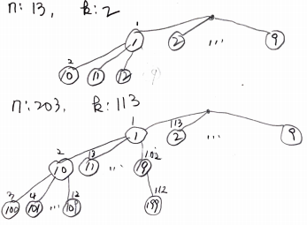
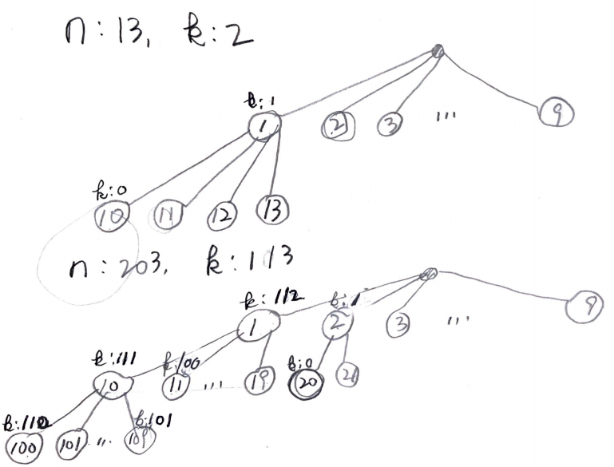

# Problem

[K-th Smallest in Lexicographical Order](https://leetcode.com/problems/k-th-smallest-in-lexicographical-order/)

# Idea

숫자 `n`, `k` 가 주어진다. `[1..n]` 의 숫자들중 사전순으로 배열했을 때
`k` 번째 숫자를 구하는 문제이다.



예를 들어 `n = 13, k = 2` 인 경우를 살펴보자. recursion tree 는 다음과
같다. 몇번째 숫자인지 번호를 붙여 보자. 이번에 방문한 숫자를 `num`
이라고 하자.  `num` 과 `num+1` 사이의 가능한 숫자가 몇개인지 알면 `k`
번째 숫자가 어디있는지 가늠할 수 있다.

`k` 를 점점 줄여가면서 탐색해 보자. `k == 0` 일 때 방문한 숫자가 곧
답이된다.



예를 들어 위의 그림에서 `num = 1` 인 경우를 살펴보자. 

* `num = 1, k = 112` 이다. `1` 과 `2` 사이에 111 개의 숫자가 가능하다. `111 <= k`  이다. `k -= 111` 을 수행하고. `num += 1` 을 하자.
* `num = 2, k = 1` 이다. `2` 와 `3` 사이에 111 개의 숫자가 가능하다. `111 > k` 이다. `2` 의 자식인 `20` 을 방문한다. `k--` 를 수행하고 `num *= 10` 을 하자.

# Implementation

* [java8](Solution.java)

# Complexity

```
O(N) O(1)
```
