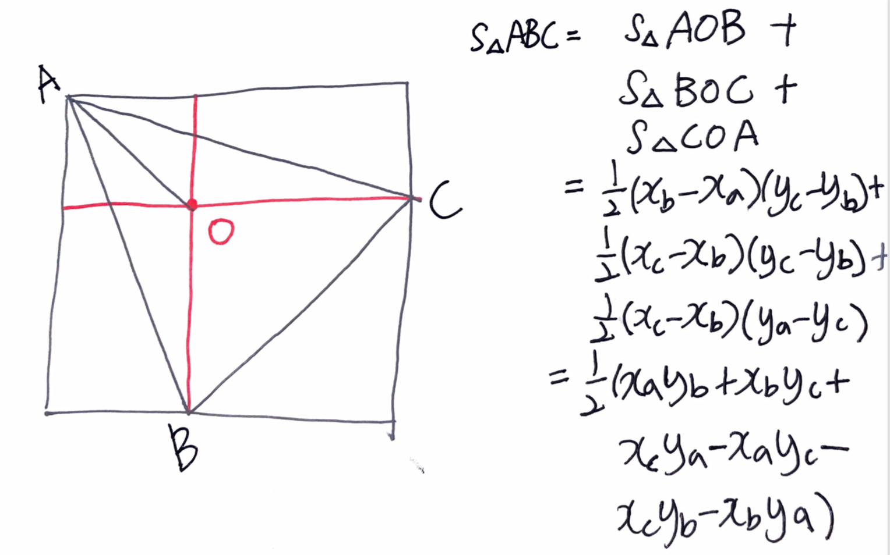

# Problem

[Largest Triangle Area](https://leetcode.com/problems/largest-triangle-area/)

# References

* [[C++/Java/Python] Solution with Explanation and Prove](https://leetcode.com/problems/largest-triangle-area/discuss/122711/C%2B%2BJavaPython-Solution-with-Explanation-and-Prove)

# Idea

점들의 모임 `P[]` 가 주어지면 임의의 세점을 선택하여 가장 넒이가 큰
삼각형의 넓이를 구하라.

다음의 그림과 같이 삼각형 ABC 의 넓이는 세가지 사각형 넓이의 절반을
모두 합한 것과 같다.



# Implementation

* [c++11](a.cpp)

# Complexity

```
O(N^3) O(1)
```
