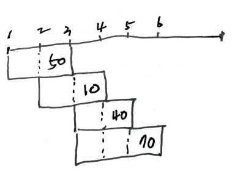

# Problem

[Maximum Profit in Job Scheduling](https://leetcode.com/problems/maximum-profit-in-job-scheduling/)

수열 `S[], E[], P[]` 가 주어진다. `S[i]` 는 시작시간, `E[i]` 는
종료시간, `P[i]` 는 수익을 의미한다. 시작시간과 종료시간이 겹치지 않은
상태에서 최대이익을 구하는 문제이다.

# Idea

예를 들어 `startTime = [1,2,3,3], endTime = [3,4,5,6], profit = [50,10,40,70]`
를 살펴보자. 

`map<int, int> maxProfitMap` 을 선언하여 `{startTime: maxProfit}` 을
저장한다.  `map<int, pair<int, int>> jobMap` 을 선언하여
`{startTime: {endTime: profit}` 을 저장한다.

이제 특정 job 의 `endTime` 으로 `maxProfitMap.lower_bound` 를 수행하여
`it` 에 저장한다. `it->second` 는 그 job 과 겹치지 않으면서 이후에 실행된 잡들의
최대수익을 의미한다.



# Implementation

* [c++11](a.cpp)

# Complexity

```
O(NlgN) O(N)
```
