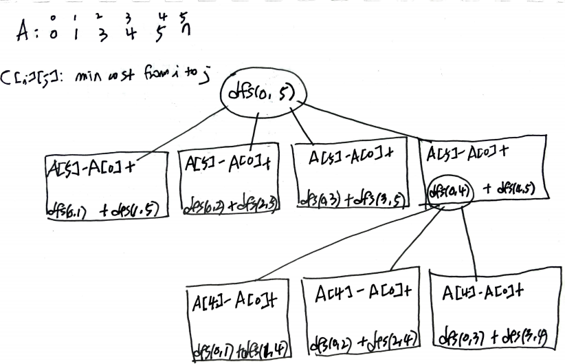

# Problem

[Minimum Cost to Cut a Stick](https://leetcode.com/problems/minimum-cost-to-cut-a-stick/)

숫자 `n`, 수열 `A[]` 가 주어진다. 길이가 `n` 인 막대를 `A[i]` 만큼
자를 수 있다. 자르기 전 길이를 모두 합하자. 모두 잘랐을 때 그 길이의
합이 최소가 되도록 한다. 그 최소값을 구하는 문제이다.

# Idea

`A[]` 에 막대의 처음을 의미하는 `0` 과 끝을 의미하는 `n` 을 삽입하고
정렬하자. 

다음과 같은 sub problem `dfs` 를 정의한다.

```
int dfs(i, j)

return: min sum which starts with i, ends with j
     i: start index
     j: end index
```

다음과 같이 recursion tree 를 그려볼 수 있다.



`int C[][]` 를 선언하여 overlapping sub problem 을 최적화
하자.

```
int C[i][j]: min sum which starts with i, ends with j
          i: start index
          j: end index
```

# Implementation

* [c++11](a.cpp)

# Complexity

```
O(N^2) O(N^2)
```
