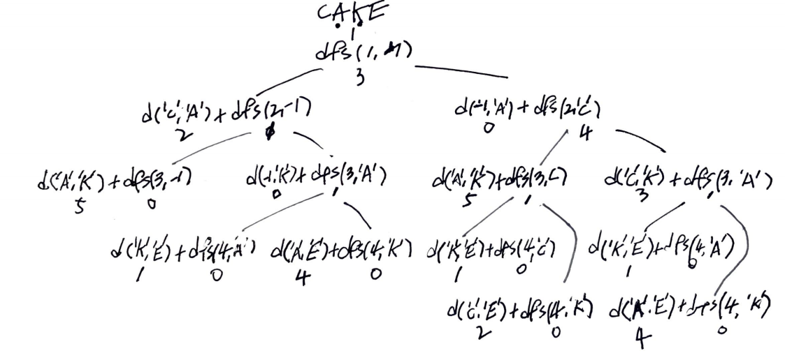

# Problem

[Minimum Distance to Type a Word Using Two Fingers](https://leetcode.com/problems/minimum-distance-to-type-a-word-using-two-fingers/)

# Idea

영문 대문자로 구성된 문자열 `s` 와 보드판 `G` 가 주어진다. 왼쪽 오른쪽
손가락을 이용해서 `s[i]` 를 가리킨다. 왼쪽 손가락이 이동할 때 거리의
합을 `a`, 오른쪽 손가락이 이동할 때 거리의 합을 `b` 라고 하자. `a + b`
의 최소값을 구하는 문제이다. 거리는 [manhattan
distance](https://xlinux.nist.gov/dads/HTML/manhattanDistance.html) 를
사용한다.

다음은 보드판 `G` 이다.

```
A B C D E F
G H I J K L
M N O P Q R
S T U V W X 
Y Z
```

예를 들어 `s = "CAKE"` 를 살펴보자.

```
 left: C A
right: K E
```

왼쪽 오른쪽 손가락으로 이해하는 것보다 최근에 이동한 손가락으로 가리킬
것인가 다른 손가락으로 가리킬 것인가로 이해하는 것이 편하다.

예를 들어 `s = "CAKE"` 의 경우 왼쪽 손가락으로 `C` 를 가리키고 오른쪽
손가락으로 `A` 를 가리킨 상황이다. `K` 를 가리킬 때 최근 손가락으로
`K` 를 가리키면 거리는 `A -> K = 5` 이고 다른 손가락으로 `K` 를
가리키면 거리는 `C -> K = 3` 이다.

이번에 가리킬 문자의 인덱스를 `i` 라고 하자.  마지막 손가락으로
가리켰던 문자의 인덱스를 `last` 라고 하자. 다른 손가락으로 가리켰던
문자의 인덱스는 `other` 라고 하자. 그렇다면 이번에 산출할 최소거리는
`min(dist(s[other], s[i])`, `dist[s[last], s[i])` 의 최소값이다.
dynamic programming 으로 해결할 만 하다.

`vector<vector<int>> C` 를 선언하여 memoization 한다.

```
C[i][j]: i 번째 문자를 가리킬 차례이고 other 가 j 일 때 최소의 거리
```

다음과 같이 부분문제 `dfs` 를 선언한다.

```c
dfs(vector<vector<int>>& C, string& s, int i, int other)

    i: 이번에 가리킬 문자의 인덱스
other: 최근에 사용하지 않은 손가락이 가리키는 문자의 인덱스
```

다음은 `s = "CAKE"` 의 경우, recursion tree 이다.



# Implementation

* [c++11](a.cpp)

# Complexity

```
O(N) O(1)
```
