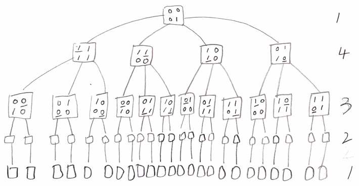

# Problem

[Minimum Number of Flips to Convert Binary Matrix to Zero Matrix](https://leetcode.com/problems/minimum-number-of-flips-to-convert-binary-matrix-to-zero-matrix/)

# Idea

숫자의 이차원 배열 `M[][]` 이 주어진다. 특정 cell 을 flipping 하면
상하좌우 이웃역시 flipping 된다. `M[][]` 의 모든 값이 0 이 되도록
flipping 해보자. 최소의 flipping 횟수를 구하는 문제이다.

[BFS](/fundamentals/graph/bfs/README.md) 를 이용하여 해결할 만하다.

`queue<vector<vector<int>> q` 를 선언하여 BFS Queue 로 이용한다.
`set<vector<vector<int>> seen` 를 선언하여 탐색한 행렬을 저장한다.
`bool zeroMatrix(vector<vector<int>>& M)` 를 정의하여 행렬의 모든 값이
0 인지 검증한다. 문제의 조건에 의해 `1 <= m < 3, 1 <= n <= 3` 이다. `m, n`
이 작기 때문에 `zeroMatrix` 로 매번 검사할 만 하다.
`flipMatrix(vector<vector<int>> M, int y, int x)` 를 정의하여 `M[y][x]`
를 중심으로 flipping 한다.

다음은 search space 를 그림으로 그려본 것이다.



시간복잡도는 `O(N!)` 이다.

# Implementation

* [c++11](a.cpp)

# Complexity

```
O(N!) O(N)
```
