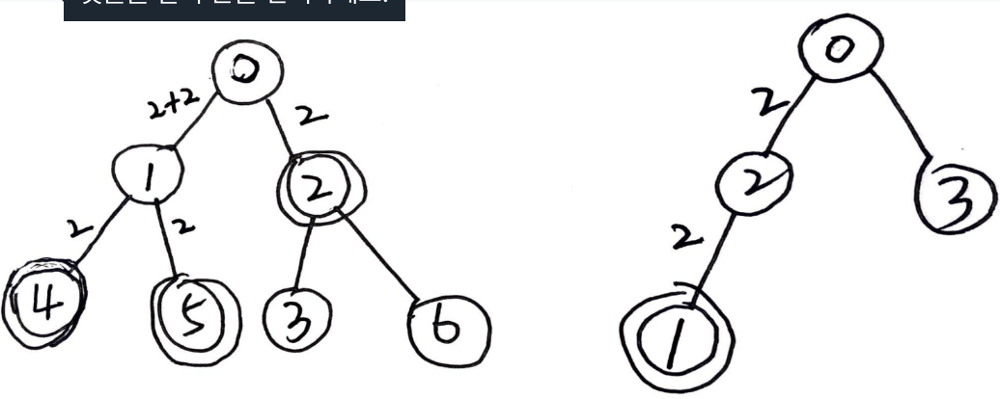

# Problem

[Minimum Time to Collect All Apples in a Tree](https://leetcode.com/problems/minimum-time-to-collect-all-apples-in-a-tree/)

Given number `n`, edges `E[][]`, has apple of nodes `B[]`.  Every edge
has 1 cost.  Return minimum cost to find all apples. 

# Idea

For example, `n = 7, edges = [[0,1],[0,2],[1,4],[1,5],[2,3],[2,6]],
hasApple = [false,false,true,false,true,true,false]` and `n = 4, edges
= [[0,2],[0,3],[1,2]], hasApple = [false,true,false,false]`.



# Implementation

* [c++11](a.cpp)

# Complexity

```
O(N) O(N)
```
