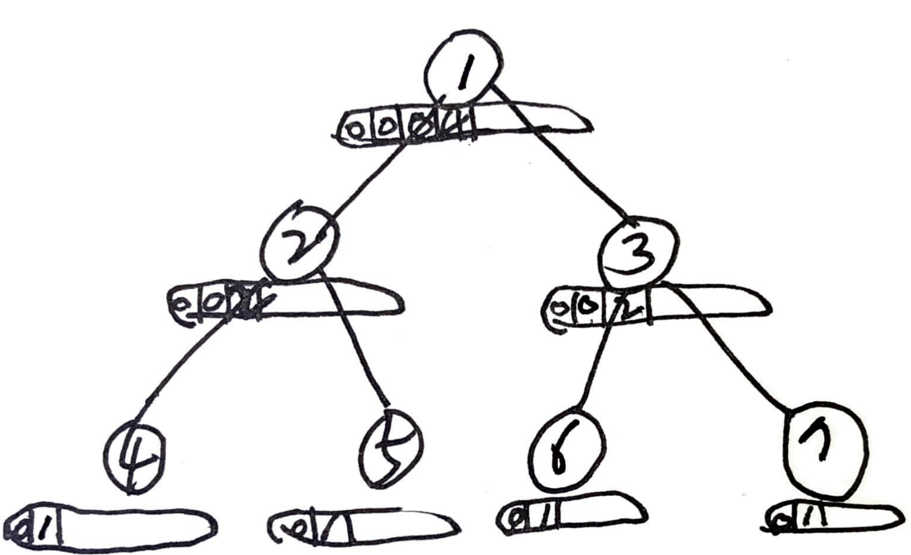

# Problem

[Number of Good Leaf Nodes Pairs](https://leetcode.com/problems/number-of-good-leaf-nodes-pairs/)

트리의 루트 `u *TreeNode` 와 거리 `dist` 주어진다.  leaf node 들의
짝들 중 그 거리가 `dist` 보다 작은 것들의 개수를 구하라.

# Idea

예를 들어 `u = [1,2,3,4,5,6,7], dist = 3` 의 경우를 살펴보자.

```
       1
     /   \ 
    2     3
   / \   / \
  4   5 6   7
  
answer: 2 [[4,5],[6,7]]
```

예를 들어 `u = [1,2,3,4,5,6,7], dist = 4` 의 경우를 살펴보자.

```
       1
     /   \ 
    2     3
   / \   / \
  4   5 6   7
  
answer: 6 [[4,5],[4,6],[4,7],[5,6],[5,7],[6,7]]
```

부분문제 `dfs(u *TreeNode, dist int) []int` 를 정의하고
재귀적으로 해결한다.

```
dfs(u *TreeNode, dist int) []int

return: the number of leaf-nodes whose distance from u is i
     u: node to visit
  dist: the distance  
```



`dfs` 는 다음과 같이 구현한다.

문제의 조건에 의해 `1 <= dist <= 10` 이다.  각 node 마다 `rootList
[]int` 를 두어 `rootList[i]` 에 거리가 `i` 인 leaf node 들의 개수를
저장한다. 

`u == nil` 이면 당연히 `make([]int, 11)` 을 리턴한다.

`leftList = dfs(u.Left, dist), rightList = dfs(u.Right, dist)` 
를 수행한다.

만약 `u.Left == nil && u.Right == nil` 이면 `rootList[1] = 1`
이다. `rootList` 를 리턴한다.

이제 `leftList[i], rightList[j]` 에 대해 `i + j <= dist` 이면
`leftList[i] * rightList[j]` 만큼의 쌍을 `ans` 에 더한다.

`rootList[i+1]` 에 `leftList[i]` 와 `rightList[i]` 를
더한다.

끝으로 `rootList` 를 리턴한다.

# Implementation

* [go](a.go)

# Complexity

```
O(N) O(lgN)
```
