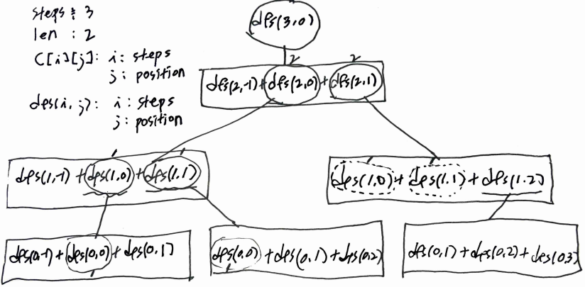

# Problem

[Number of Ways to Stay in the Same Place After Some Steps](https://leetcode.com/problems/number-of-ways-to-stay-in-the-same-place-after-some-steps/)

숫자 `steps`, `len` 이 주어진다. `len` 길이 만큼의 막대가 있다.
인덱스 `0` 에서 시작하여 `steps` 만큼 왼쪽, 오른쪽 으로 이동하거나
제자리에 멈출 수 있다. 한번 동작 할 때 마다 `steps` 를 하나 감소한다.
`steps` 가 0 이 될 때 `0` 번 인덱스에 멈춰서도록 해보자. 모든 경우의
수를 구하는 문제이다.

# Idea

예를 들어 `steps = 3, len = 2` 인 경우 다음과 같은 경우의 수를
생각해 볼 수 있다.

```
Right - Left - Stay
Stay - Right - Left
Right - Stay - Left
Stay - Stay - Stay
```

다음과 같은 subproblem `dfs` 를 정의해 보자.

```
int dfs(i, j)

return: the count of cases
     i: steps
     j: position
```

다음과 같이 recursion tree 를 그려보자.



이제 `int C[][]` 를 선언하여 overlapping subproblem 을
최적화 해보자.

```
int C[i][j]: the count of cases
          i: steps
          j: position
```

# Implementation

* [c++11](a.cpp)

# Complexity

```
O(S^2) O(S^2)

S: steps
N: len
```
