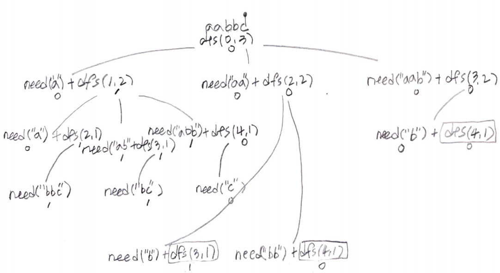

[Palindrome Partitioning III](https://leetcode.com/problems/palindrome-partitioning-iii/)

# Idea

Given string `s` and number `k`, find the minimal numbers of
characters of `s` such as every `k` substring is palindrome.

For an instance, `s = "abc", k = 2`.

We can divide "abc" by 2 groups like these.

```
a bc
ab c
```

When we make a substring, if it is palindrome we don't need any
characters to be changed. So we need to consider all cases for
grouping and count minimal numbers of characters to be changed.

Dynamic programming is a good solution.

This is a subproblem for DFS.

```c
int dfs(vector<vector<int>>& C, string& s, int i, int k)

return: minimal number of characters to be changed.
     c: cache for i, k
     s: s is given
     i: index of s
     k: number of groups to make
```

This is a recursion tree for `s = "aabbc", k = 3`



# Implementation

* [c++11](a.cpp)

# Complexity

```
O(SK) O(SK)
```
