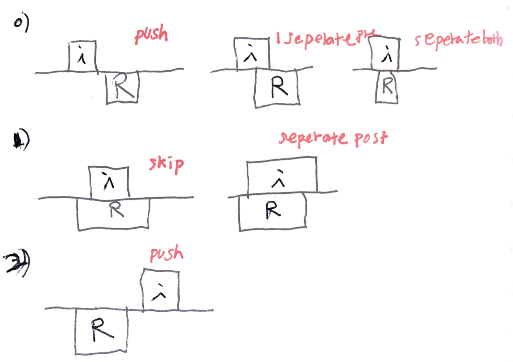

# Problem

[Remove Interval](https://leetcode.com/problems/remove-interval/)

# Idea

간격의 모음 `I[]` 와 제거해야할 간격 `R` 이 주어진다. `I[]` 에서 `R` 
을 제거한 간격의 모음을 구하는 문제이다.

`I[i]` 와 `R` 의 관계에 따라 모든 경우의 수는 다음과 같다.



`R` 을 기준으로 `I[i]` 의 관계를 다음과 같이 정리할 수 있다.

* `I[i][1] < R[0] || R[1] < I[i][0]`
  * push `I[i]`
* `I[i][1] > R[0]`
  * push `[I[i][0], R[0]]`
* `R[1] < I[i][1]`
  * push `[R[1], I[i][1]]`

# Implementation

* [go](a.go)

# Complexity

```
O(N) O(N)
```
