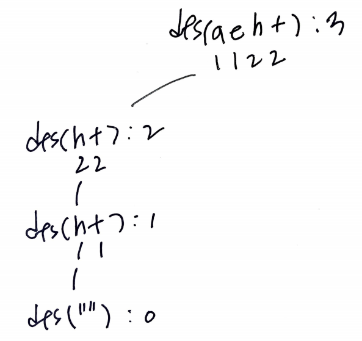

# Problem

[Stickers to Spell Word](https://leetcode.com/problems/stickers-to-spell-word/)

문자열의 모음 `S[]`, 문자열 `T` 가 주어진다.
`S[i]` 의 문자들 중 필요한 것만 사용하여 문자열 `T`
를 구성할 수 있다. `S[]` 를 최소의 개수로 사용하여
`T` 를 구성할 수 있을 때 그 최소의 개수를 구하라.

# Idea

`S[]` 를 하나씩 선택하여 모두 시도해 본다. 이때 overlapping subproblem
들이 존재하기 때문에 memoization 으로 최적화 한다. dynamic programming
으로 해결할 만 하다.

다음과 같이 부분문제 `dfs` 를 정의하여 재귀적으로 해결해보자.

```cpp
int dfs(unordered_map<string, int>& C, vector<vector<int>>& stickerFreqs, string& target)

      return: minimum count of stickers to make target
           C: C[reduced target] = min count of stickers to make reduced target
stickerFreqs: frequencies of sticker
      target: target string
```

`target` 을 줄여가면서 dfs 한다.



# Implementation

* [c++11](a.cpp)

# Complexity

```
```
