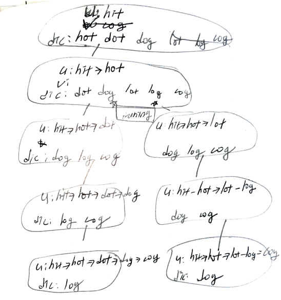

# Problem

[Word Ladder II](https://leetcode.com/problems/word-ladder-ii/)

시작 단어와 종료 단어 `bw, ew` 와 단어들의 모음 `dic[]` 가 주어진다.
시작 단어에서 종료 단어까지 각 단어들의 한 문자씩만 교체하여 도달할 수
있는지 검증하는 문제이다. 중간 단어들은 `dic[]` 에 포함되어야 한다.

# Idea

BFS 로 해결한다. 현재 노드 `u` 를 지금까지 진행한 단어들의 모음이라
하자.  다음 노드 `v` 는 `u` 에 `dic[i]` 를 삽입한 것이다.  방문한
단어들은 `seen[]` 에 추가해 놓고 이미 방문한 단어들은 `dic[]` 에서도
제거해야 한다. 

`seen[]` 은 거리가 늘어날 때 마다 초기화 해야 한다. 방문한 단어들은
이미 `dic[]` 에서 지워졌기 때문이다. 한번 방문했던 단어를 다시
방문하는 것은 infinite loop 를 발생시킨다.

예를 들어 `bw = "hit", ew = "cog", dic =
("hot","dot","dog","lot","log","cog")` 인 경우를 살펴보자.



`u: hit-hot-dot`, `u: hit-hot-lot` 의 두 경우 `dic` 를 주목하자.
각각 `dic: dog, log, cog`, `dic: dog, log, cog` 이다. `dot, lot` 가 함께 삭제되었다. 

최단 거리를 구하는 문제이기 때문에 `dot, lot` 는 이미 길이가 3 인
경로에 추가되었으므로 `dic` 에 남겨 두어 다음에 방문하게 할 필요가
없다.

Java 로 구현하는 경우 문자열 비교를 위해 `a == b` 대신 `a.equals(b)`
를 사용해야 한다.

# Implementation

* [c++11](a.cpp)
* [java8](MainApp.java)

# Complexity

```
O(26^W) O(N)
 W: length of beginWord
 N: count of wordList
```
