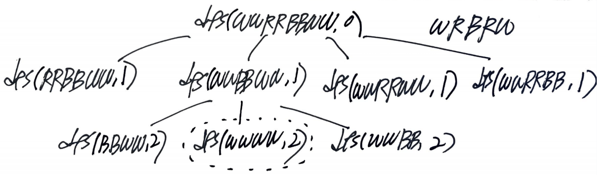

# Problem

[Zuma Game](https://leetcode.com/problems/zuma-game/)

문자열 `board`, `hand` 가 주어진다. `board` 의 문자열 중 같은 문자로
구성된 3 개의 문자열을 계속해서 지워 나가야 한다. 이때 `hand` 의
문자를 하나씩 가져와서 `board` 의 사이에 끼워 넣을 수 있다.  `hand` 의
문자들을 최소의 개수로 사용해서 `board` 를 모두 비워야 한다.  그때
최소의 개수를 구하라. 만약 `board` 를 비우는 것이 불가능 하다면 `-1`
을 리턴하라.

# Idea

`board` 를 처음부터 끝까지 순회하면서 `hand` 에서 꺼내온 문자를
이용하여 지울만 하면 지운다. 이것을 반복해서 `hand` 에서 꺼내온 문자의
개수의 최소값을 저장한다. back tracking 으로 해결할
만 하다.

다음과 같은 부분문제 `dfs` 를 정의한다.

```
void dfs(unordered_map<char, int> cntMap, string& board, int used)

cntMap: {character : count} of hand
 board: characters of board
  used: used characters from hand
```



# Implementation

* [c++11](a.cpp)

# Complexity

```
O(B!) O(B)
```
