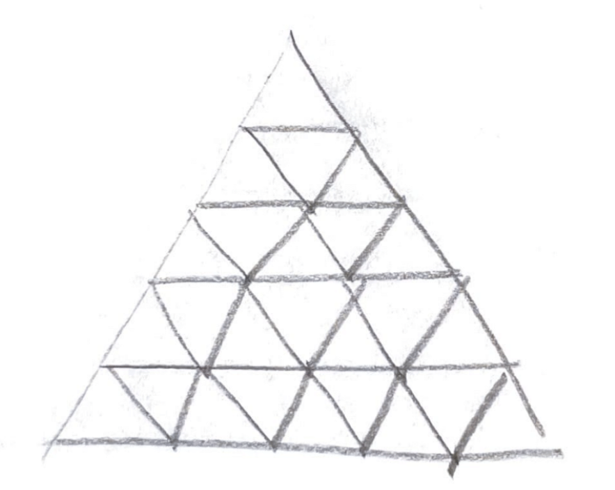
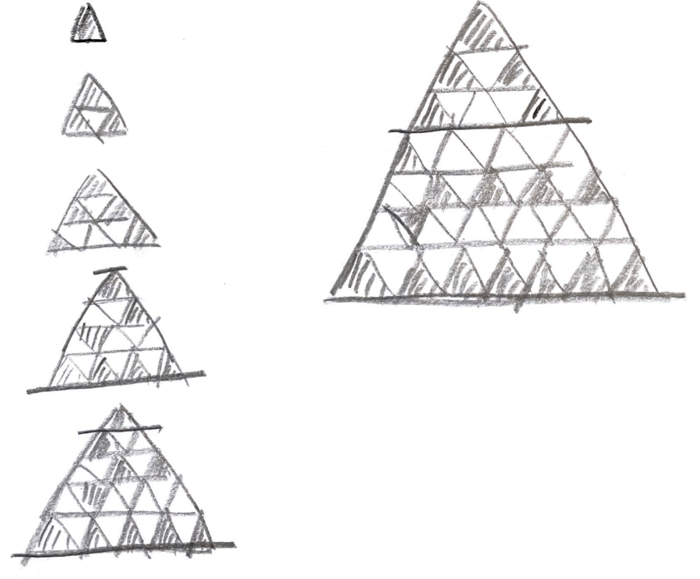

# Problem

[Color the Triangle Red](https://leetcode.com/problems/color-the-triangle-red/)

숫자 `n` 이 주어진다. `n` 만큼의 행을 가진 삼각형들의 모음이 있다고
해보자. 삼각형의 개수는 `n ^ 2` 이다.

예를 들어 `n == 5` 이면 삼각형들의 모음은 다음과 같다.



서로다른 두개의 삼각형과 연결된 삼각형을 칠할 수 있다고 하자.  모든
삼각형을 칠하기 위해 필요한 최소 삼각형의 수를 구하라.

# Idea

다음과 같이 다양한 `n` 에 대하여 최소 삼각형수를 생각해 보자.



아래부터 4 행씩 다음과 같은 패턴이 반복된다.

* 첫번째 행은 첫번째 삼각형을 칠한다.
* 두번째 행은 세번째 삼각형부터 하나씩 건너뛰며 칠한다.
* 세번째 행은 두번째 삼각형을 칠한다.
* 네번째 행은 첫번째 삼각형부터 하나씩 건너뛰며 칠한다.

나머지는 양끝의 삼각형을 칠한다.

# Implementation

* [java11](MainApp.java)

# Complexity

```
O(N^2) O(N)
```
