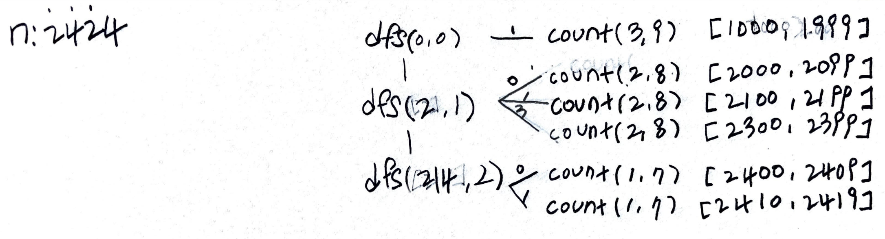

# Problem

[Count Special Integers](https://leetcode.com/problems/count-special-integers/)

숫자 `n` 이 주어진다. 자리수 중복이 없는 숫자를 special integer 라고
하자.  `[1, n]` 영역의 숫자들중 special integer 의 개수를 구하라.

# Idea

예를 들어 `n = 20` 인 경우를 살펴보자.

```
1 2 3 4 5 6 7 8 9
10 __ 12 13 14 15 16 17 18 19 20
```

따라서 답은 `19` 이다.

숫자의 자리수가 주어지고 special integer 를 구해보자.

```
1 digit special integers: 9               9
2 digit special integers: 9 * 9           81
3 digit special integers: 9 * 9 * 8       648
4 digit special integers: 9 * 9 * 8 * 7   4536
```

숫자 `n` 이 주어졌을 때 첫번째 자리수 후보의 개수는 `0` 을 제외하고
`9` 개 이다. 두번째 자리부터 숫자 후보의 개수는 `0` 을 포함하고 이전에
사용한 숫자를 배제하기 때문에 `9` 부터 하나씩 줄어든다.

한편 첫번째 자리수 역시 `0` 을 포함할 수 있다고 해보자. 다음과 같이
재귀적으로 special interger 개수를 구현할 수 있다.

```java
digitCnt: 남아있는 자리수의 개수
 candCnt: 사용할 수 있는 후보 숫자의 개수
 
count(digitCnt, candCnt) {
    // base
    if (digitCnt == 0) {
        return 1;
    }
    // recursion
    return (candCnt - digitCnt + 1) * count(digitCnt - 1, candCnt);
}
```

이제 `n` 이 `2424` 의 경우를 살펴보자. 

`[1, 999]` 는 앞서 구현한 `count()` 로 special integer 개수를 구할 수
있다.

```
     [1, 9]: 9 * count(0, 9)
   [10, 99]: 9 * count(1, 9)
 [100, 999]: 9 * count(2, 9)
```

`[1000, 2424]` 는 완전탐색으로 해결할 만 하다. 다음과 같이 dfs 를
구현한다.

```
dfs(int bm, int i)

    bm: bitmask for used digit
     i: digit order
return: count of special integers
```



# Implementation

* [java11](MainApp.java)

# Complexity

```
O(logN) O(logN)
```
